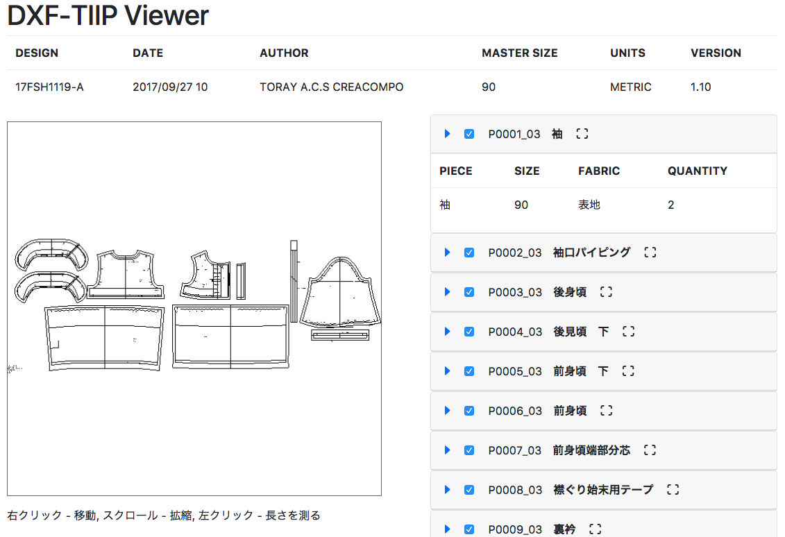

# Three-Dxf-TIIP

**Three-Dxf-TIIP** is a javascript viewer for dxf-tiip files. It takes dxf objects produced from Dxf-Parser and renders them using
 three.js.

For now we recommend cloning the repo, and starting with our sample. See **Run Samples** below.



#### Usage
```html
<button id="open-dxf-tiip-view" url="dxf/sample.dxf">クリックして別ウィンドウでファイルを見る</button>
```

```javascript
// See index.js in the sample for more details
<script src="dxf-tiip-view.js"></script>
<script>
DxfTiipView.set('#open-dxf-tiip-view', "dxf-tiip-view.html");
</script>
```

#### Run Samples
```
> cd sample
> bower install
> python -m http.server
```

After performing the steps above, you can see the example at localhost:8080. You can use the dxf file included in the sample.

Note that the sample contains some three.js extras for Text support. If you wish to view text in DXF files, you will need those extras.

#### Contributors
stagesp1@gmail.com
